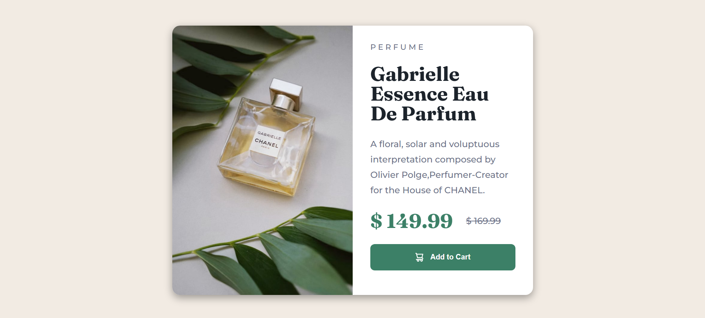

# Frontend Mentor - Product preview card component solution

This is a solution to the [Product preview card component challenge on Frontend Mentor](https://www.frontendmentor.io/challenges/product-preview-card-component-GO7UmttRfa). Frontend Mentor challenges help you improve your coding skills by building realistic projects.

## Table of contents

- [Overview](#overview)
  - [The challenge](#the-challenge)
  - [Screenshot](#screenshot)
  - [Links](#links)
- [My process](#my-process)
  - [Built with](#built-with)
  - [What I learned](#what-i-learned)
  - [Continued development](#continued-development)
  - [Useful resources](#useful-resources)
- [Author](#author)

## Overview

### The challenge

Users should be able to:

- View the optimal layout depending on their device's screen size
- See hover and focus states for interactive elements

### Screenshot



### Links

- Solution URL: [ solution URL](https://your-solution-url.com)
- Live Site URL: [ live site URL](https://your-live-site-url.com)

## My process

### Built with

- Semantic HTML5 markup
- CSS custom properties
- Flexbox
- CSS Grid
- Mobile-first workflow
- Sass

### What I learned

I learned how to use sass to make write css style easier

To see how you can add code snippets, see below:

```scss
.card {
  display: flex;
  flex-direction: column;
  width: 340px;
  background-color: $color-neutral-white;
  border-radius: 14px;
  overflow: hidden;
  margin: $spacing-400 0;
  box-shadow: rgba(0, 0, 0, 0.35) 0px 5px 15px;
  @media (min-width: 768px) {
    flex-direction: row;
    width: 655px;
    max-width: 655px;
  }
}
```

### Continued development

i think a can learn more about flex

### Useful resources

- [Sass](https://sass-lang.com/) - Documentation about Sass
- [MDN Web Docs](https://developer.mozilla.org/en-US/docs/Web/CSS/flex) - about flex

## Author

- GitHub - [ArrifUber](https://github.com/ArrifUber)
- Frontend Mentor - [@ArrifUber](https://www.frontendmentor.io/profile/ArrifUber)
